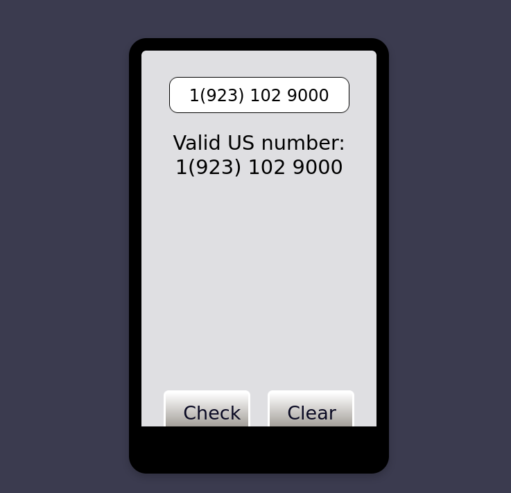

# Phone Number Validator

A simple web application that validates US phone numbers. This project is built as part of the FreeCodeCamp JavaScript Algorithms and Data Structures Certification.

## Project Requirements

- **Validates** various US phone number inputs for correctness.
- **Handles invalid inputs**, including non-numeric characters and incorrect formats.
- **Displays error messages** for invalid inputs and confirms the number format.

### Valid Formats Include:
- `1 555-555-5555`
- `1 (555) 555-5555`
- `5555555555`
- `(555)555-5555`

## Screenshot

